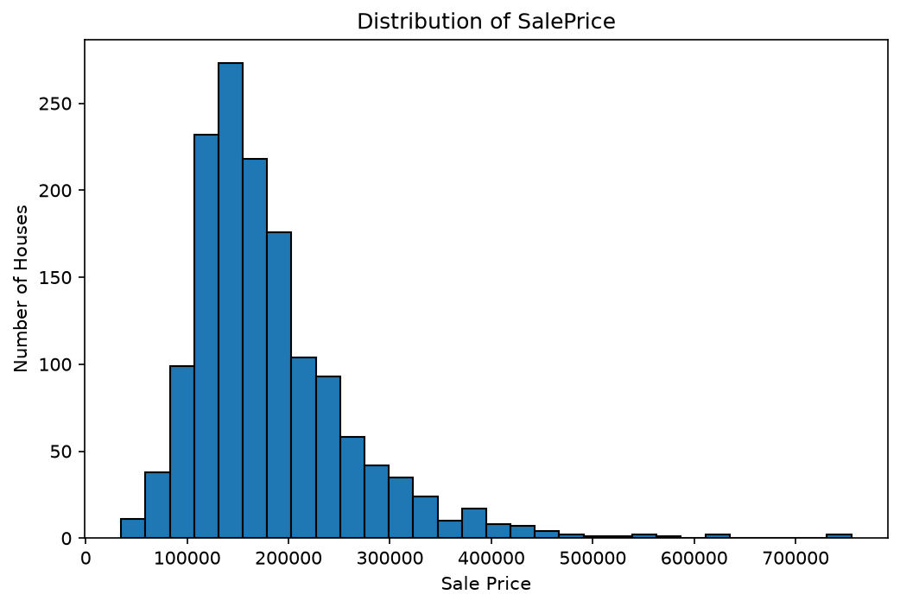
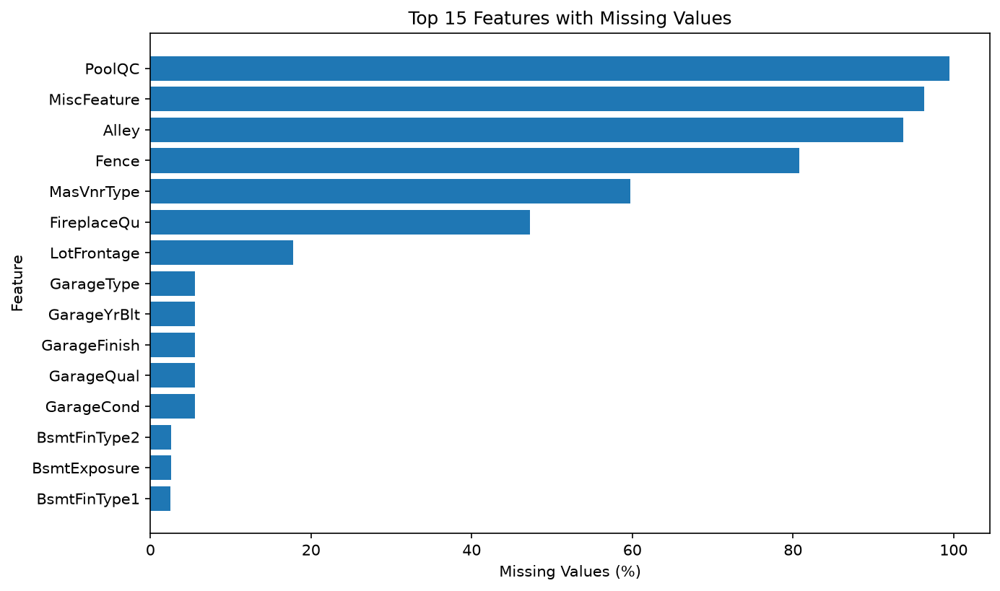
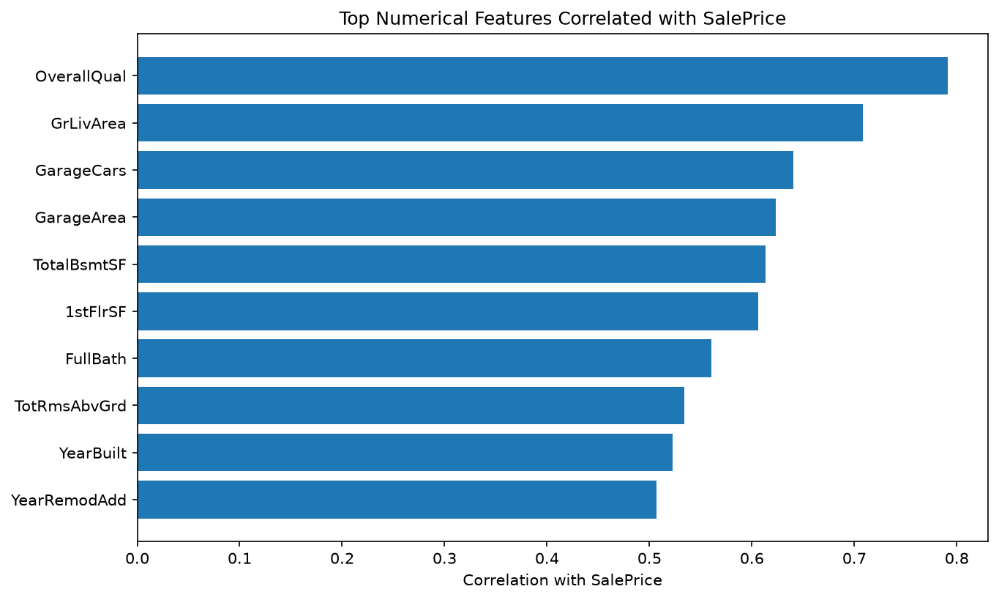
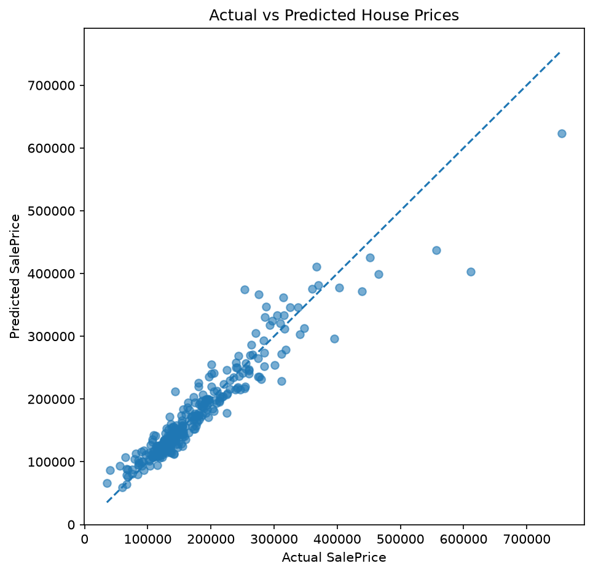
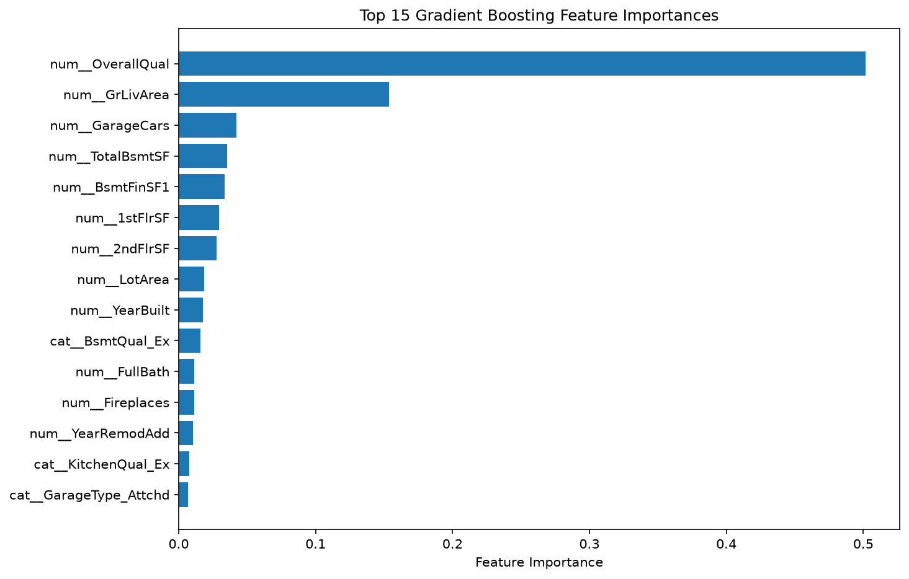
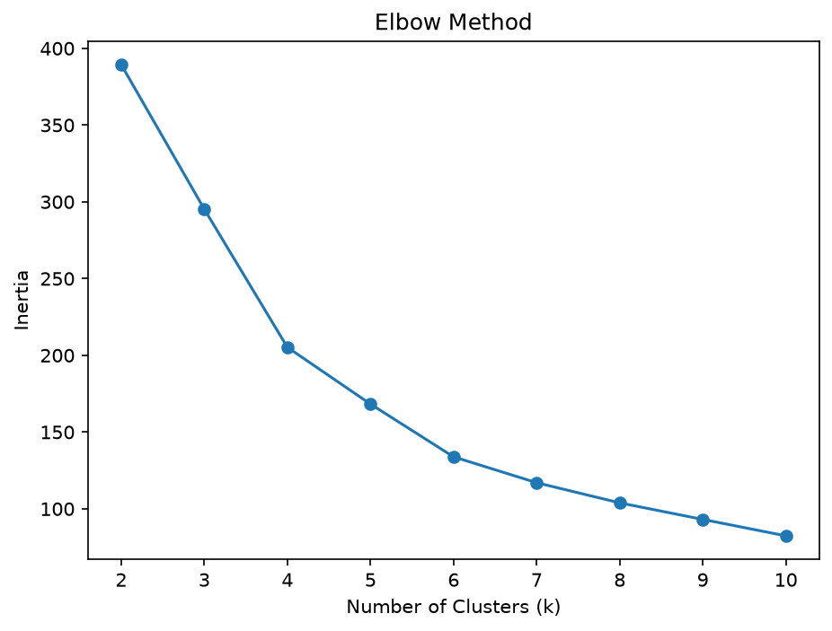
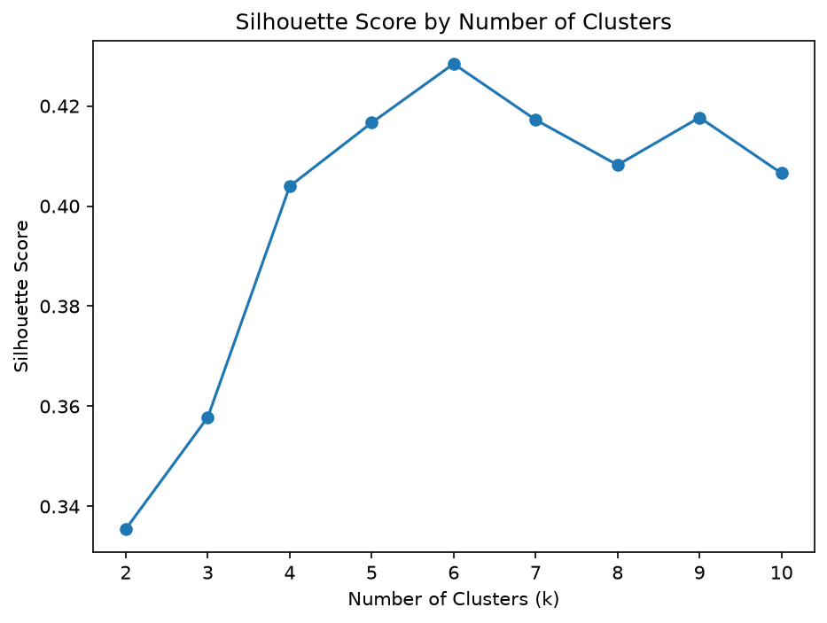
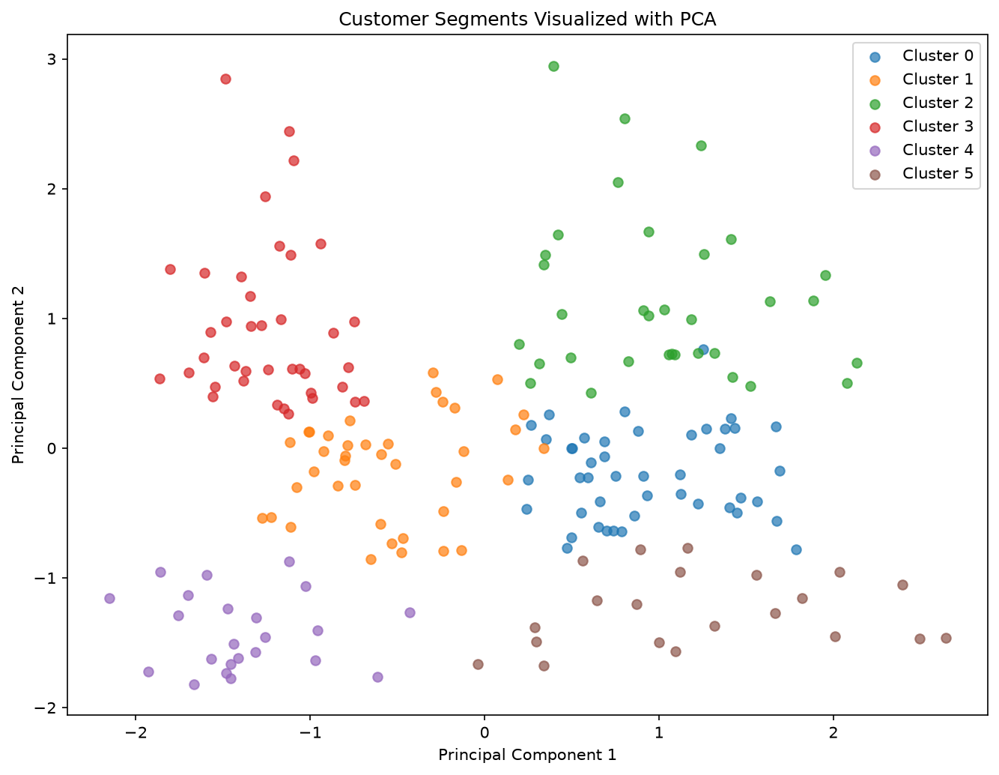
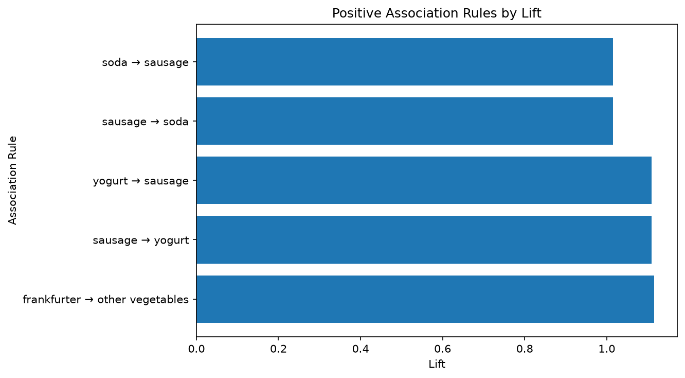

# CMPE 255 — Assignment 1

## AI-Assisted Data Science

This repository contains my work for CMPE 255 Assignment 1.

The assignment explores how an agentic AI coding assistant can support an
end-to-end data science workflow while the student remains responsible for
executing, validating, understanding, and explaining the results.

The project is organized into two parts:

- **Part 1:** AI-assisted end-to-end data science using a Kaggle dataset
- **Part 2:** Replication of selected data science experiments from the
  professor's `data_science_examples` repository

---

# Part 1 — House Price Prediction

## Project Overview

For Part 1, I used the Kaggle **House Prices: Advanced Regression Techniques**
dataset to build a supervised machine learning workflow for predicting
residential sale prices.

The target variable is:

`SalePrice`

The analysis follows a workflow inspired by CRISP-DM:

1. Business Understanding
2. Data Understanding
3. Data Preparation
4. Modeling
5. Evaluation
6. Interpretation and Communication

AI tools were used to assist with planning, code generation, debugging,
analysis, and documentation. However, generated code and results were executed,
checked, and interpreted before being included in the final project.

---

## Dataset

The training dataset contains:

- **1,460 observations**
- **81 columns**
- Numerical and categorical features
- **0 duplicate rows**

The target variable `SalePrice` is strongly right-skewed, with a skewness of
approximately **1.88**.

An important part of the data-cleaning process was investigating missing
values. Several values that initially appeared to be missing actually represented
the absence of property features.

Examples include:

- `PoolQC = NA` → no pool
- `GarageType = NA` → no garage
- `BsmtQual = NA` → no basement
- `MasVnrType = None` → no masonry veneer

This investigation helped avoid incorrectly treating meaningful property
information as generic missing data.

---

## Exploratory Data Analysis

The numerical features most strongly correlated with `SalePrice` included:

- `OverallQual` — approximately **0.79**
- `GrLivArea` — approximately **0.71**
- `GarageCars` — approximately **0.64**
- `GarageArea` — approximately **0.62**
- `TotalBsmtSF` — approximately **0.61**

The analysis suggests that overall property quality and usable living space
are strongly associated with house sale prices.

---

## Data Preparation

The preprocessing workflow handled numerical and categorical variables
separately.

Numerical features were processed using:

- Missing-value imputation
- Feature scaling where appropriate

Categorical features were processed using:

- Domain-aware missing-value handling
- Missing-value imputation where necessary
- One-hot encoding

Scikit-learn `Pipeline` and `ColumnTransformer` were used to make the
preprocessing and modeling workflow reproducible.

---

## Models Evaluated

Four regression approaches were evaluated:

1. Dummy Regressor
2. Ridge Regression
3. Random Forest Regressor
4. Gradient Boosting Regressor

The Dummy Regressor was used as a baseline so that the machine learning
models could be compared against a simple average-price prediction strategy.

The complete model comparison is available here:

[`results/model_comparison.csv`](Part-1/house-prices/results/model_comparison.csv)

---

## Best Model — Gradient Boosting

Gradient Boosting achieved the strongest validation performance.

Approximate validation results:

- **RMSE:** $27,790
- **MAE:** $17,165
- **R²:** 0.899

The model substantially outperformed the Dummy baseline, which produced an
RMSE of approximately $87,619.

---

## Cross-Validation

To determine whether the Gradient Boosting performance depended heavily on
one train-validation split, I also performed 5-fold cross-validation.

Results:

- **Mean CV RMSE:** approximately $26,871
- **Standard deviation:** approximately $3,651

The cross-validation result was similar to the original validation result,
providing additional evidence that the model generalizes reasonably well
across different subsets of the dataset.

Detailed results:

[`results/cross_validation_rmse.csv`](Part-1/house-prices/results/cross_validation_rmse.csv)

---

## Model Interpretation

The Gradient Boosting feature-importance analysis identified the following as
some of the strongest predictive features:

- `OverallQual` — approximately 50% of total feature importance
- `GrLivArea` — approximately 15%
- `GarageCars`
- `TotalBsmtSF`
- `BsmtFinSF1`
- `1stFlrSF`

These findings are consistent with the earlier correlation analysis.

Feature importance describes how the model uses variables for prediction and
should not be interpreted as evidence of causation.

---

## Prediction Error Analysis

Although the final model performed well overall, some individual predictions
contained large errors.

Several of the largest underpredictions occurred for expensive homes. For
example, one property sold for approximately $611,657 but was predicted at
approximately $403,266.

This suggests that unusual or high-priced properties may contain
characteristics that are more difficult for the model to capture.

The complete prediction-error results are available here:

[`results/prediction_errors.csv`](Part-1/house-prices/results/prediction_errors.csv)

---

## Visualizations

### SalePrice Distribution

### Missing Values

### Numerical Correlations

### Actual vs Predicted Prices

### Gradient Boosting Feature Importance

---

## Part 1 Project Artifacts

### Notebook

[`house_prices_analysis.ipynb`](Part-1/house-prices/notebooks/house_prices_analysis.ipynb)

The final notebook was restarted and executed from beginning to end to verify
that the analysis is reproducible.

### Dataset

[`train.csv`](Part-1/house-prices/data/train.csv)

### Results

- [`model_comparison.csv`](Part-1/house-prices/results/model_comparison.csv)
- [`cross_validation_rmse.csv`](Part-1/house-prices/results/cross_validation_rmse.csv)
- [`prediction_errors.csv`](Part-1/house-prices/results/prediction_errors.csv)
- [`feature_importance.csv`](Part-1/house-prices/results/feature_importance.csv)

### Project Planning

- [`intent.md`](Part-1/house-prices/intent.md)
- [`spec.md`](Part-1/house-prices/spec.md)
- [`plan.md`](Part-1/house-prices/plan.md)

These planning documents are supplemental artifacts used to organize the
AI-assisted workflow.

---

## AI-Assisted Workflow

The AI assistant was used for tasks such as:

- Planning the data science workflow
- Suggesting exploratory analysis
- Generating Python code
- Debugging notebook issues
- Designing preprocessing pipelines
- Comparing regression models
- Interpreting model results
- Organizing documentation

AI output was not accepted blindly.

For example, during missing-value analysis, additional inspection revealed
that Pandas' default parsing behavior could interpret meaningful values such
as `NA` and `None` as missing data. The preprocessing approach was adjusted
after examining the actual domain meaning of those values.

The final explanations in this project are based on my interpretation of the
executed results.

- [Original ChatGPT Transcript](Part-1/house-prices/chat-transcript/ChatGPT-HW%20%231-Transcript.pdf)
- [English Transcript Summary](Part-1/house-prices/chat-transcript/ENGLISH_TRANSCRIPT_SUMMARY.md)

---

# Part 2 — Data Science Experiment Replication

Part 2 replicates selected data science experiments using an AI coding
assistant.

The experiments are:

1. Customer Segmentation
2. Market Basket Analysis
3. Anomaly Detection

---

## 1. Customer Segmentation

### Overview

This experiment uses K-Means clustering to identify meaningful customer
segments from the Mall Customers dataset.

The clustering features were:

- `Age`
- `Annual Income (k$)`
- `Spending Score (1-100)`

The dataset contains:

- **200 customers**
- **5 columns**
- **0 missing values**
- **0 duplicate rows**

`CustomerID` was excluded because it is only an identifier.

The three numerical clustering features were standardized using
`StandardScaler` before applying K-Means.

### Selecting the Number of Clusters

Multiple values of `k` from 2 to 10 were evaluated using:

- Elbow Method
- Silhouette Score

The highest Silhouette Score was:

- **k = 6**
- **Silhouette Score = 0.428417**

The Elbow Method also indicated that a solution around this range was
reasonable.

Therefore, the final K-Means model used **6 clusters**.

### Customer Segments

The final cluster profiles were:

| Cluster | Avg Age | Avg Income | Avg Spending Score | Customers |
| ------- | ------: | ---------: | -----------------: | --------: |
| 0       |   56.33 |      54.27 |              49.07 |        45 |
| 1       |   26.79 |      57.10 |              48.13 |        39 |
| 2       |   41.94 |      88.94 |              16.97 |        33 |
| 3       |   32.69 |      86.54 |              82.13 |        39 |
| 4       |   25.00 |      25.26 |              77.61 |        23 |
| 5       |   45.52 |      26.29 |              19.38 |        21 |

The clusters were interpreted as:

1. **Older Moderate Customers**
2. **Young Moderate Customers**
3. **High-Income Low Spenders**
4. **High-Income High Spenders**
5. **Young Low-Income High Spenders**
6. **Older Low-Income Low Spenders**

One important finding was that Clusters 0 and 1 had similar income and
spending behavior but differed substantially in age.

This helped explain why the three-feature clustering produced six clusters
even though the earlier two-dimensional income-versus-spending visualization
appeared to show approximately five groups.

### PCA Visualization

PCA was used to reduce the three clustering features to two dimensions for
visualization.

The first two principal components explained approximately:

- **PC1:** 44.3%
- **PC2:** 33.3%
- **Total:** 77.6%

PCA was used only for visualization. The K-Means model itself was trained
using all three standardized features.

### Visualizations

#### Elbow Method

#### Silhouette Scores

#### PCA Customer Segments

### Artifacts

- [Customer Segmentation Notebook](Part-2/customer-segmentation/notebook/customer_segmentation.ipynb)
- [K Selection Results](Part-2/customer-segmentation/results/k_selection_results.csv)
- [Cluster Profiles](Part-2/customer-segmentation/results/cluster_profiles.csv)
- [Customer Segment Assignments](Part-2/customer-segmentation/results/customer_segments.csv)

---

## 2. Market Basket Analysis

### Overview

This experiment uses the Apriori algorithm and association rule mining to
analyze grocery purchasing patterns.

The dataset contains:

- **3,898 unique members**
- **167 unique grocery items**
- **14,963 unique transactions**

A transaction was defined as all products purchased by the same member on
the same date.

Exact duplicate item records were removed before basket encoding because the
analysis focuses on whether an item appears in a transaction rather than the
quantity purchased.

### Frequent Itemset Mining

The transaction data was converted into a Boolean basket matrix.

The initial Apriori analysis used:

- **Minimum support = 0.01**

This produced:

- **69 frequent itemsets**

However, the association rules generated at this threshold had lift values
below 1.

The minimum support threshold was then reduced to:

- **0.005**

This allowed less frequent product relationships to be examined.

### Association Rules

The lower support threshold produced:

- **5 rules with lift greater than 1**

The strongest positive association was:

`frankfurter → other vegetables`

with:

- **Support:** 0.005146
- **Confidence:** 0.136283
- **Lift:** 1.11615

This means that approximately 0.51% of all transactions contained both
frankfurter and other vegetables.

Among transactions containing frankfurter, approximately 13.6% also contained
other vegetables.

The lift of approximately 1.116 indicates that the products appeared together
about 11.6% more often than expected if their purchases were independent.

This was interpreted as a **modest positive association**, not a strong
purchasing relationship.

Other positive associations included:

- `sausage → yogurt`
- `yogurt → sausage`
- `sausage → soda`
- `soda → sausage`

### Key Finding

One important finding from this experiment is that products with high purchase
frequency are not necessarily strongly associated with one another.

For example, whole milk was the most frequently occurring product, but frequent
co-occurrence alone did not produce strong positive lift.

Support, confidence, and lift therefore need to be considered together when
interpreting market-basket relationships.

### Visualization

### Artifacts

- [Market Basket Notebook](Part-2/market-basket-analysis/notebook/market_basket_analysis.ipynb)
- [Frequent Itemsets](Part-2/market-basket-analysis/results/frequent_itemsets.csv)
- [Association Rules](Part-2/market-basket-analysis/results/association_rules.csv)

---

## 3. Anomaly Detection

**Status: In progress**

The final Part 2 experiment will replicate an anomaly detection workflow using
an AI coding assistant.

Results and artifacts will be added after the experiment is executed and
validated.

---

# YouTube Walkthrough

The final Assignment 1 walkthrough will explain the end-to-end AI-assisted
data science process and the results in my own words.

**YouTube Link:** To be added after recording.

---

# Assignment Status

## Part 1

**Complete**

The House Prices notebook, figures, results, AI transcript, English transcript
summary, and supporting project artifacts are included in this repository.

## Part 2

**2 of 3 experiments complete**

Completed:

- Customer Segmentation
- Market Basket Analysis

Remaining:

- Anomaly Detection

---

## Author

Changhyun Kim  
San José State University  
CMPE 255 — Data Mining  
Fall 2026
